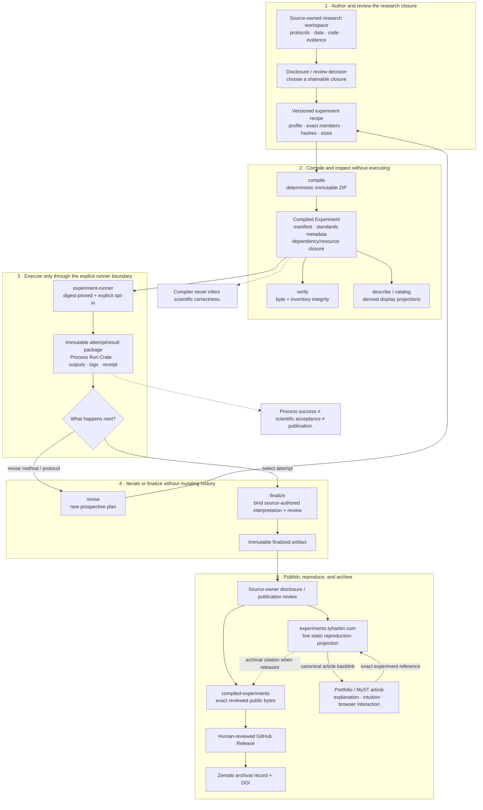
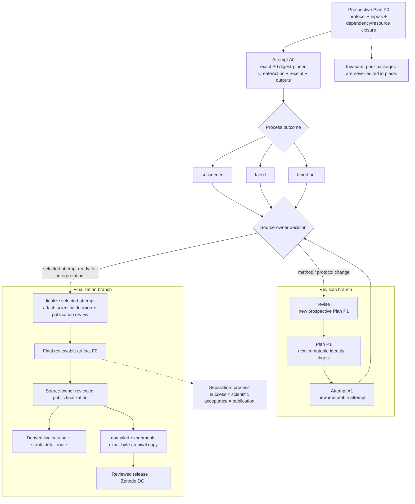
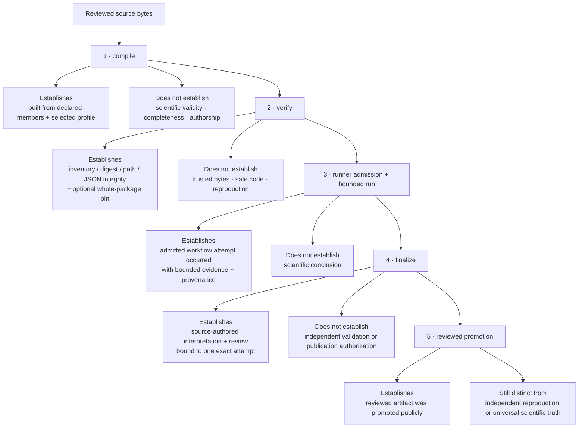
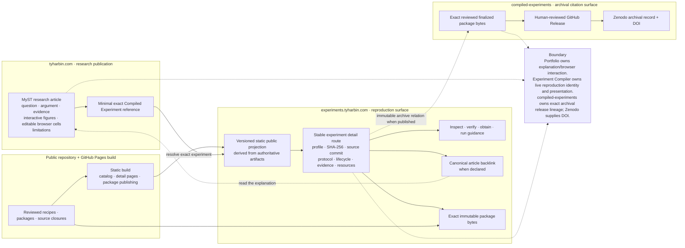

# Experiment Compiler architecture

> Status: current project architecture and north-star boundaries, 2026-09-29.

Experiment Compiler turns reviewed research inputs into immutable, inspectable experiment artifacts. The diagrams on this page make the project's boundaries explicit: what the compiler owns, what the runner owns, how immutable lifecycle artifacts relate, which public standards carry semantics, and how the public reproduction surface connects back to explanatory research articles.

The diagrams are maintained as Mermaid source under [`docs/diagrams/`](diagrams/).

## 1. Project map

The project is deliberately split into five stages: author/review, compile/inspect, explicit execution, immutable lifecycle transitions, and publication/reproduction.

Source: [`01-project-map.mmd`](diagrams/01-project-map.mmd)

## 2. Immutable lifecycle and artifact lineage

Plans, attempts, revisions, finalizations, and public releases are separate immutable artifacts. Historical packages are never silently edited in place.

Source: [`02-lifecycle-lineage.mmd`](diagrams/02-lifecycle-lineage.mmd)

## 3. Package anatomy and standards

The Compiled Experiment ZIP is an immutable byte envelope. Experiment Compiler owns package construction, integrity, and lifecycle relationships; source-authored research content and established public standards carry the scientific meaning.

```mermaid
flowchart TB
  RECIPE["experiment.json recipe<br/>profile · exact source/path/hash/size"]

  subgraph ZIP["Compiled Experiment ZIP · immutable byte envelope"]
    subgraph ID["Identity + research-object structure"]
      MAN["experiment-package-manifest.json<br/>generated member inventory"]
      ROC["ro-crate-metadata.json<br/>RO-Crate graph + lifecycle links"]
    end

    subgraph SCI["Source-authored scientific content"]
      PROT["protocol.md<br/>question · method · controls · stop/accept rules"]
      SRC["implementation · config · shareable data"]
      CRO["Croissant metadata<br/>when dataset semantics apply"]
    end

    subgraph REP["Reproduction closure + execution handoff"]
      CLOS["dependency-closure.json<br/>embedded · immutable public · host/ABI · unavailable"]
      RES["resource evidence / estimates<br/>CPU · RAM · storage · time"]
      EXEC["workflow.cwl · job.yml · runner.json<br/>when executable"]
    end

    subgraph EVI["Evidence + provenance"]
      EVID["attempts · outputs · logs · receipts"]
      DEC["scientific decision · publication review"]
    end
  end

  RECIPE --> MAN
  RECIPE --> ROC
  RECIPE --> PROT
  RECIPE --> SRC
  RECIPE --> CRO
  RECIPE --> CLOS
  RECIPE --> RES
  RECIPE --> EXEC
  RECIPE --> EVID
  RECIPE --> DEC

  subgraph STD["Standards reused instead of a custom ontology"]
    RO["RO-Crate 1.3<br/>research-object structure"]
    PRC["Process Run Crate 0.6<br/>actual execution provenance"]
    SCH["Schema.org<br/>Action / CreativeWork / Review states"]
    PROV["PROV-O<br/>derivation + revision links"]
    CWL["CWL 1.2<br/>workflow + portable resource requests"]
    CR["MLCommons Croissant<br/>dataset metadata"]
  end

  ROC --> RO
  EVID --> PRC
  ROC --> SCH
  ROC --> PROV
  EXEC --> CWL
  CRO --> CR

  BOUND["Compiler owns the byte envelope, lifecycle relationships, and integrity checks.<br/>Scientific meaning remains source-authored."]
  ZIP -.-> BOUND
```

Source: [`03-package-anatomy.mmd`](diagrams/03-package-anatomy.mmd)

## 4. Trust boundaries and claim scope

Each command has a deliberately narrow evidence scope. Package integrity, process execution, scientific interpretation, publication, and independent reproduction are related but distinct claims.

Source: [`04-trust-boundaries.mmd`](diagrams/04-trust-boundaries.mmd)

## 5. Public research ↔ reproduction surface

The publication system has three distinct responsibilities. Portfolio/MyST owns explanation and bounded browser interaction. Experiment Compiler owns immutable reproduction identity, closure, provenance, verification/execution handoff, and the derived live experiment presentation. `pH34r-pH/compiled-experiments` owns the reviewed immutable archival copy and release/DOI lineage after source-owner publication approval.

Source: [`05-public-surface.mmd`](diagrams/05-public-surface.mmd)

## Design invariants

- Compile and verify never execute packaged experiment code.
- Historical artifact bytes are immutable; revisions create new identities and provenance links.
- A process succeeding does not imply scientific acceptance.
- Finalization carries source-authored interpretation; it does not invent or independently validate a conclusion.
- Public promotion is a reviewed publication event, not a synonym for independent reproduction.
- `compiled-experiments` archival releases never rebuild or rerun a finalized package; they preserve exact reviewed public bytes plus release metadata.
- A GitHub Release/Zenodo DOI is archival/citation provenance, not a scientific-acceptance or independent-reproduction state.
- The public catalog is derived from authoritative recipes/artifacts rather than a second manually maintained registry.
- Portfolio articles own explanation and interactive presentation; Experiment Compiler owns exact reproduction identity and evidence.
- Where an established standard fits, prefer it over a repository-local ontology.
